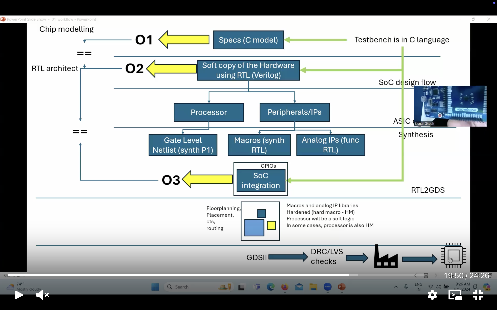
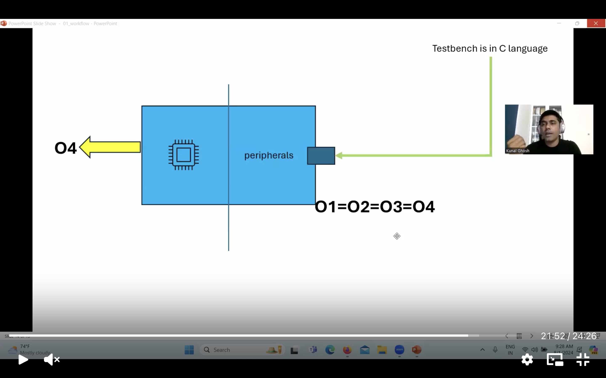
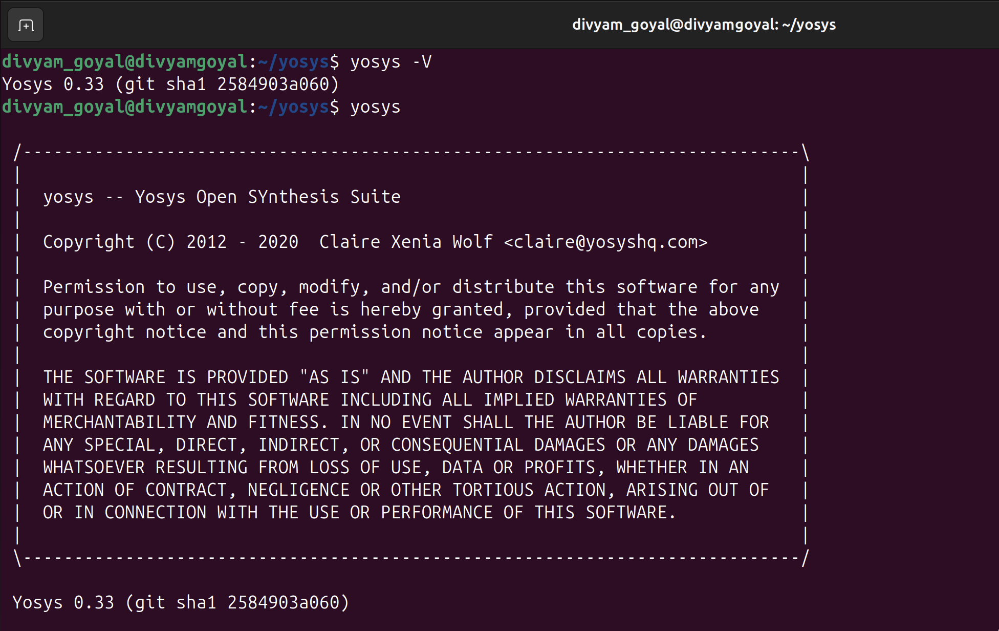
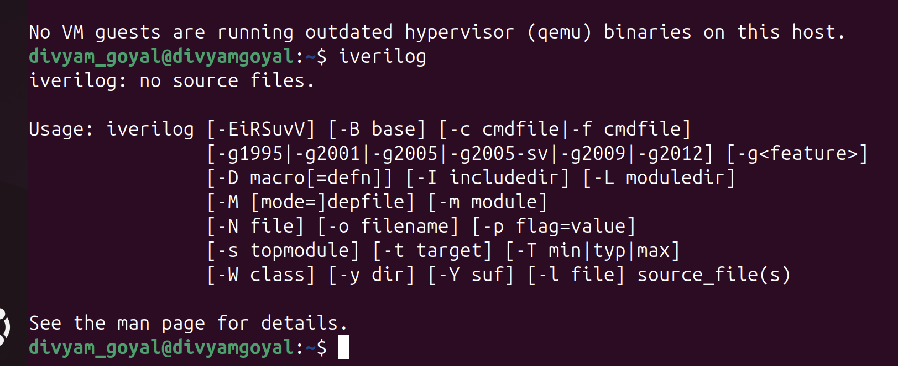
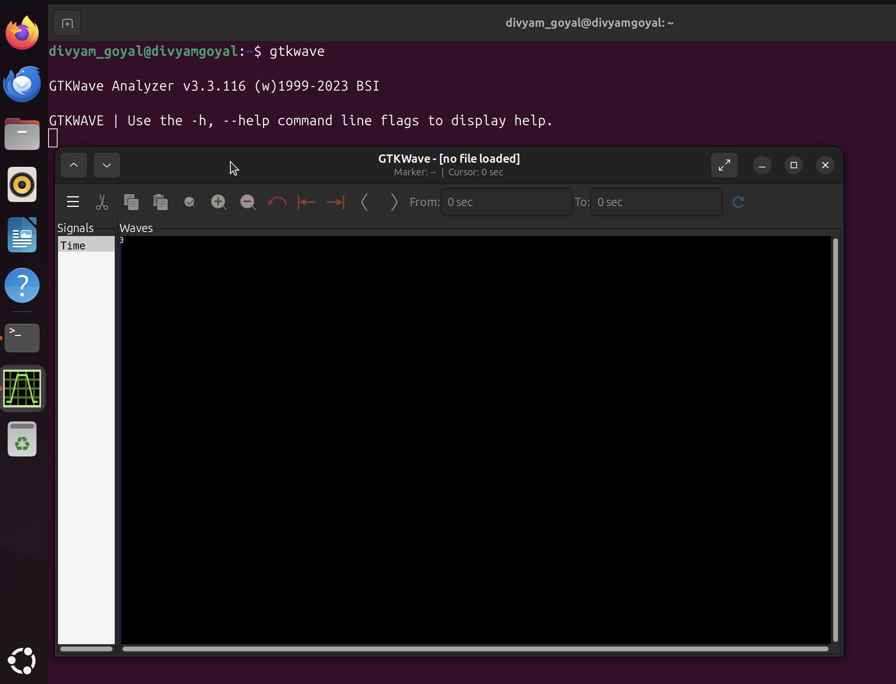

# Week 0 - Setup and Tools Installation
    
## Task 1
## RTL to GDSII SoC Design Flow

This covers the complete journey of designing a **System-on-Chip (SoC)**, starting from high-level specifications and ending at a verified GDSII layout.

---

## 🔹 Design Flow Steps

### 1. **Chip Modelling (O1)**

* Begin with **specifications** using a **C model**.
* Create a **C testbench** to validate functionality at this level.

---

### 2. **RTL Design (O2)**

* Write the **soft copy of hardware** using **RTL (Verilog)**.
* Model different blocks:
  * **Processor**
  * **Peripherals / IPs**
* Verify functionality through RTL testbenching.

---

### 3. **Synthesis & Netlist Generation**

* Convert RTL into a **Gate-Level Netlist**.
* Include supporting elements:

  * **Macros (synthesized RTL)**
  * **Analog IPs (functional RTL)**
* Netlist represents the circuit structure in terms of logic gates.

---

### 4. **SoC Integration (O3)**

* Integrate **Processor, Macros, Analog IPs, GPIOs, and Peripherals** into a single SoC.
* Validate correctness of the overall system.

---

### 5. **Physical Design (RTL2GDS)**

* Perform the following steps:

  * **Floorplanning**
  * **Placement**
  * **Clock Tree Synthesis (CTS)**
  * **Routing**
* Place **hardened macros and analog IP libraries** in layout.
* Generate the **GDSII file** (final chip layout).

---

### 6. **Verification & Signoff**

* Run **DRC (Design Rule Check)** to ensure layout follows manufacturing rules.
* Run **LVS (Layout vs. Schematic)** to confirm layout matches logical design.
* A clean DRC/LVS means the design is ready for fabrication (tape-out).



---

## ✅ Final Validation

The SoC design is declared successful when:

**O1 = O2 = O3 = O4**

* **O1** → C Model (Specs)
* **O2** → RTL Design
* **O3** → SoC Integration
* **O4** → Final SoC with Peripherals

This equivalence ensures the chip behaves **consistently** across specification, RTL, integration, and physical implementation.



## Task 2

## Yosys
```
$ git clone https://github.com/YosysHQ/yosys.git
$ cd yosys 
$ sudo apt install make (If make is not installed please install it) 
$ sudo apt-get install build-essential clang bison flex \
    libreadline-dev gawk tcl-dev libffi-dev git \
    graphviz xdot pkg-config python3 libboost-system-dev \
    libboost-python-dev libboost-filesystem-dev zlib1g-dev
$ make 
$ sudo make install
```


## Iverilog
```
$ sudo apt-get install iverilog
```


## GTKWave
```
$ sudo apt update
$ sudo apt install gtkwave
```


### 🌟 Key Learnings from Week 0
- Installed and verified **open-source EDA tools** successfully.  
- Learned about **basic environment setup** for RTL design and synthesis.  
- Prepared the system for upcoming **RTL → GDSII flow experiments**.
</details>

#### **Core RTL Design & Synthesis Tools**

| Tool | Purpose | Verification |
|------|---------|--------------|
| 🧠 **Yosys** | RTL Synthesis & Logic Optimization | ✅ Verified |
| 📟 **Iverilog** | Verilog Simulation & Compilation | ✅ Verified |
| 📊 **GTKWave** | Waveform Viewer & Analysis | ✅ Verified |
| ⚡ **Ngspice** | Analog & Mixed-Signal Simulation | ✅ Verified |
| 🎨 **Magic VLSI** | Layout Design & DRC Verification | ✅ Verified |

#### **Advanced Flow Tools**

| Tool | Purpose | Verification |
|------|---------|--------------|
| 🐳 **Docker** | Containerization Platform | ✅ Verified |
| 🌊 **OpenLane** | Complete RTL-to-GDSII Flow | ✅ Verified |

